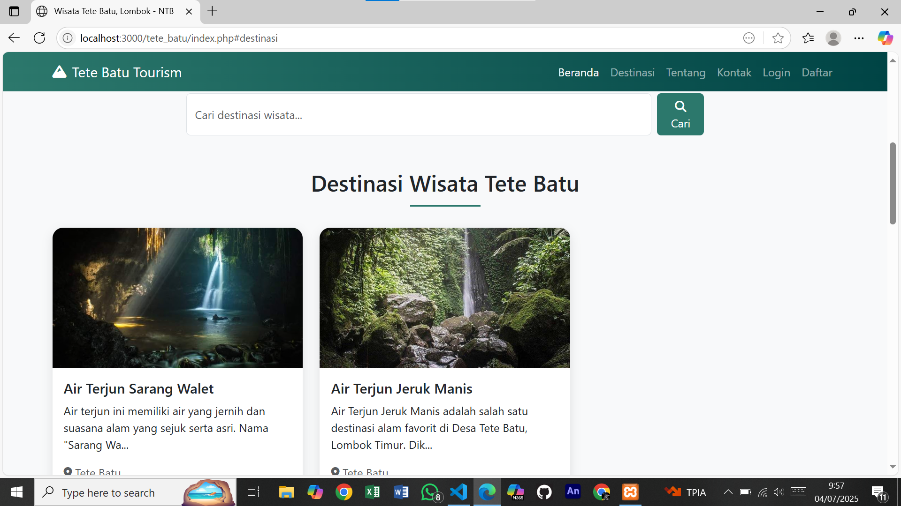

# Website-Tete-Batu-kelompok-1-
## 1. Tujuan Website
* Mempromosikan Destinasi Wisata Tete Batu
Menyediakan informasi lengkap dan menarik tentang tempat-tempat wisata unggulan di Desa Tete Batu agar dikenal lebih luas oleh wisatawan lokal maupun mancanegara.
* Meningkatkan Jumlah Kunjungan Wisatawan
Dengan informasi yang mudah diakses secara online, website ini diharapkan dapat mendorong lebih banyak wisatawan untuk datang berkunjung.
* Memberikan Informasi yang Akurat dan Terpercaya
Menyajikan detail destinasi, rute perjalanan, fasilitas, serta foto-foto asli dari tempat wisata agar pengunjung dapat merencanakan perjalanan dengan lebih baik.
* Mendukung Digitalisasi dan Promosi Pariwisata Lokal
Website ini menjadi bagian dari transformasi digital untuk memperkuat promosi desa wisata dan mendukung ekonomi lokal melalui teknologi.
* Menyediakan Fitur Interaktif bagi Pengguna
Fitur pencarian, registrasi, dan form masukan bertujuan untuk meningkatkan keterlibatan pengguna dan memperoleh feedback untuk pengembangan lebih lanjut.

## 2. Website dibangun menggunakan (html,css,JavaScript,php,mysql)

## 3. Website berjalan
### Beranda

### Destinasi

### Tentang

### Kontak

### Daftar

### Login

## 4. Kontributor
* Khairul Warisin Hammami
* Inggita Delsa Aviva
* Ahmad Arfin
* Zulkarnaen

## 5. Lisensi
Proyek ini bersifat open-source dan boleh digunakan untuk keperluan edukasi.
